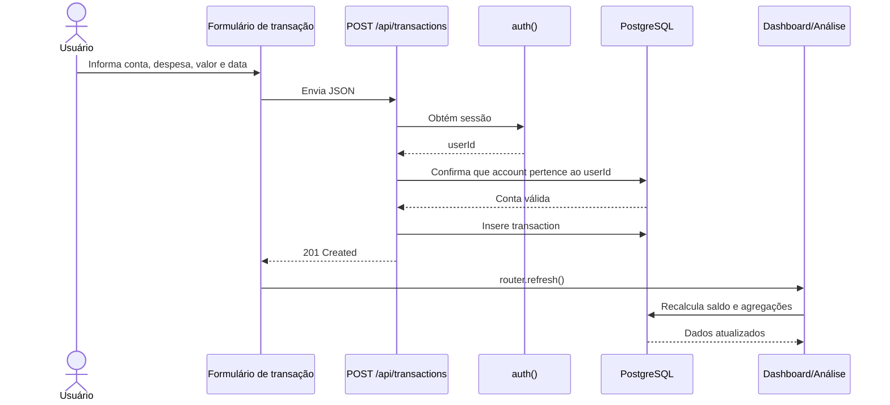

# Arquitetura e regras de negócio

## Contexto e arquitetura lógica

O MyFinanceApp é um monólito full-stack em Next.js. Páginas Server Components consultam uma camada de queries; componentes client-side fazem interações de formulário via Route Handlers. O banco é PostgreSQL hospedado no Neon. Auth.js protege navegação e APIs conferem sessão novamente antes de manipular dados.

```mermaid
flowchart LR
  U[Usuário] --> MW[Middleware Auth.js]
  MW -->|anônimo| LOGIN[/login]
  MW -->|autenticado| APP[Páginas Next.js]
  APP --> Q[lib/queries]
  APP --> C[Componentes Client]
  C --> API[Route Handlers /api]
  API --> A[auth()]
  API --> Q
  Q --> DB[(PostgreSQL Neon)]
  A --> JWT[Sessão JWT]
```

## Stack e bibliotecas

| Camada | Tecnologia | Responsabilidade |
|---|---|---|
| Aplicação | Next.js 15, React 18, TypeScript | App Router, SSR, rotas e componentes. |
| Estilo | Tailwind CSS 3, `clsx`, `tailwind-merge`, CVA | Utilitários CSS, composição de classes e variantes de botão. |
| Autenticação | `next-auth` beta / Auth.js, `bcryptjs` | Credentials Provider, JWT e hash de senha. |
| Dados | `@neondatabase/serverless`, PostgreSQL/Neon | Conexão SQL serverless e persistência relacional. |
| Gráficos | Recharts | Fluxo de caixa, patrimônio e gastos por categoria. |
| Proteção prevista | `@upstash/ratelimit`, `@upstash/redis` | Dependências instaladas, porém não há uso encontrado no código atual. |

## Rotas de interface

| Rota | Proteção | Responsabilidade |
|---|---|---|
| `/` | Sim | Dashboard, perfil, contas e resumo consolidado. |
| `/login` | Pública; redireciona autenticado | Login por credenciais. |
| `/register` | Pública; redireciona autenticado | Cadastro de credencial. |
| `/transacoes` | Sim | Extrato, filtros, edição e exclusão. |
| `/analise` | Sim | KPIs, gráficos e exportações client-side. |
| `/investments` | Sim | Placeholder da V2. |

O `middleware.ts` deixa endpoints `/api/auth`, `/api/register`, `/api/accounts`, `/api/transactions` e `/api/investments` fora do redirecionamento de páginas; a autorização dessas APIs é tratada pelos próprios handlers, exceto o cadastro público.

## APIs

| Método e rota | Sessão | Operação |
|---|---|---|
| `POST /api/register` | Não | Cria usuário e credencial em `neon_auth`. |
| `GET/POST /api/auth/[...nextauth]` | Não | Endpoints internos do Auth.js. |
| `GET /api/accounts` | Sim | Lista contas do usuário com saldo derivado. |
| `POST /api/accounts` | Sim | Cria conta financeira. |
| `GET /api/transactions` | Sim | Lista lançamentos, com filtros `accountId`, `categoryId`, `startDate`, `endDate`, `month`. |
| `POST /api/transactions` | Sim | Cria lançamento em conta pertencente ao usuário. |
| `PUT /api/transactions/:id` | Sim | Atualiza lançamento próprio. |
| `DELETE /api/transactions/:id` | Sim | Exclui lançamento próprio. |
| `GET/POST /api/investments` | Não efetiva | Stubs: retornam coleção/objeto vazio. |

## Modelo de dados financeiro

```mermaid
erDiagram
  USER ||--o{ ACCOUNT : possui
  ACCOUNT ||--o{ TRANSACTION : registra
  CATEGORY ||--o{ TRANSACTION : classifica
  ACCOUNT ||--o{ INVESTMENT : contem
  USER ||--o{ CATEGORY : personaliza

  USER { uuid id PK
         text email UK
         text name }
  ACCOUNT { uuid id PK
            uuid user_id FK
            text name
            text type
            text currency }
  CATEGORY { uuid id PK
             uuid user_id FK_nullable
             text name
             text type
             text color }
  TRANSACTION { uuid id PK
                uuid account_id FK
                uuid category_id FK_nullable
                numeric amount
                text type
                date occurred_at }
  INVESTMENT { uuid id PK
               uuid account_id FK
               numeric invested_amount
               numeric current_value }
```

`db/schema.sql` documenta as tabelas financeiras `user`, `account`, `category`, `transaction` e `investment`, com `CHECK` para tipos de conta e transação. Porém, a autenticação e o cadastro em produção apontam para um schema distinto, `neon_auth."user"` e `neon_auth.account`. A relação entre o usuário de autenticação e `account.user_id` precisa ser confirmada no banco antes de tratar o fluxo completo como consistente; esta é a principal divergência arquitetural atual.

## Regras de negócio

1. **Titularidade é obrigatória.** Toda leitura financeira parte de `account.user_id = session.user.id`. Criação, edição e exclusão de transação verificam a conta associada ao usuário da sessão.
2. **Saldo é derivado.** `account` não armazena saldo. Saldo = soma de `amount` para `receita` menos valores dos demais tipos de transação. Isso elimina recálculo após edição/exclusão.
3. **Resumo consolidado.** Receita soma apenas `receita`; despesa soma apenas `despesa`; saldo segue a regra do item anterior. No estado atual, `transferencia` reduz o saldo em queries de saldo, embora não tenha fluxo de contrapartida entre contas.
4. **Conta válida.** Uma conta requer nome e tipo em `corrente`, `poupanca` ou `investimento`; moeda padrão é `BRL`.
5. **Categorias.** Uma categoria pode ser global (`user_id IS NULL`) ou do usuário; a listagem combina ambas. O formulário mostra categorias correspondentes a receita/despesa selecionada.
6. **Datas.** `occurred_at` é data sem horário. Apresentação no extrato usa timezone UTC para não alterar o dia.
7. **Investimento.** O modelo prevê valores aplicado e atual por ativo/conta, mas o endpoint e UI não implementam seu ciclo de negócio.

### Caso de uso principal: registrar e refletir uma despesa



## Organização do código

```text
app/                 páginas App Router e Route Handlers
components/ui/       primitives visuais reutilizáveis
components/accounts/ interação de criação de conta
components/transactions/ filtros e ações de lançamento
components/analytics/ painel analítico
components/charts/   gráficos Recharts
lib/auth.ts          Auth.js e Credentials Provider
lib/db.ts            cliente Neon SQL
lib/queries/         acesso a dados financeiro
db/schema.sql        modelo financeiro de referência
KB/                  documentação operacional e de produto
```

## Riscos e próximos ajustes recomendados

- Resolver e documentar a ligação entre `neon_auth` e as tabelas financeiras; o schema SQL de referência e o código de auth não usam a mesma tabela de usuário.
- Aplicar validação de domínio no servidor para valor positivo, tipos permitidos de transação, formato de data e categoria compatível com o tipo.
- Definir a semântica de transferência como duas transações vinculadas (saída e entrada) ou removê-la até haver contrapartida; hoje ela afeta saldo como saída única.
- Integrar `TransactionModal` em uma página, verificar erros da resposta de criação e adicionar feedback de sucesso/falha.
- Implementar rate limit real nas rotas de login/cadastro, pois Upstash está apenas instalado.
- Ligar investimentos às queries existentes e adicionar constraint única `(account_id, name)` se o `upsert` for mantido.
